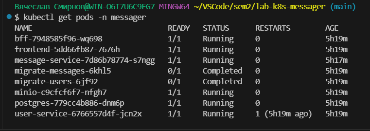
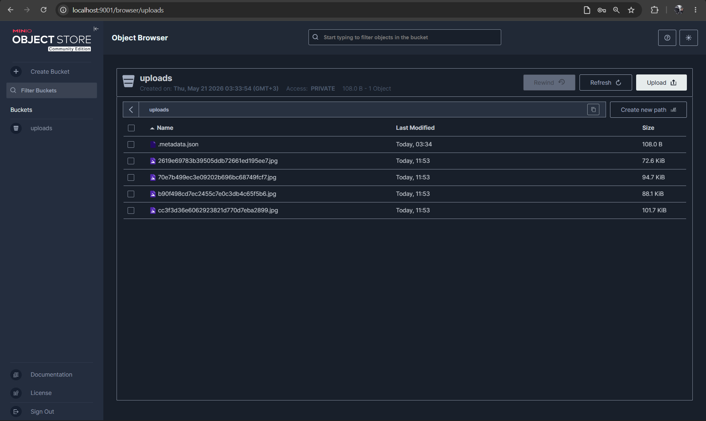
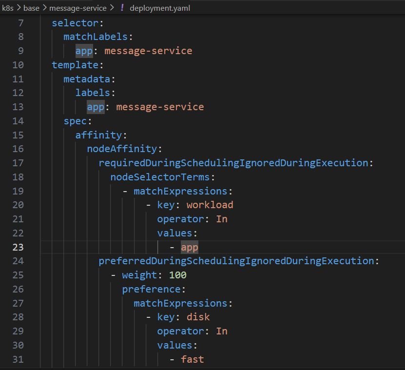
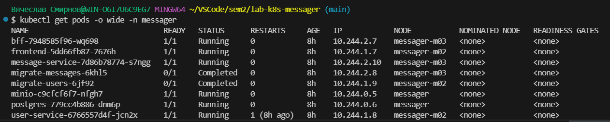
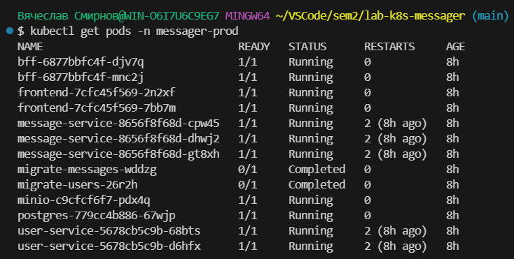
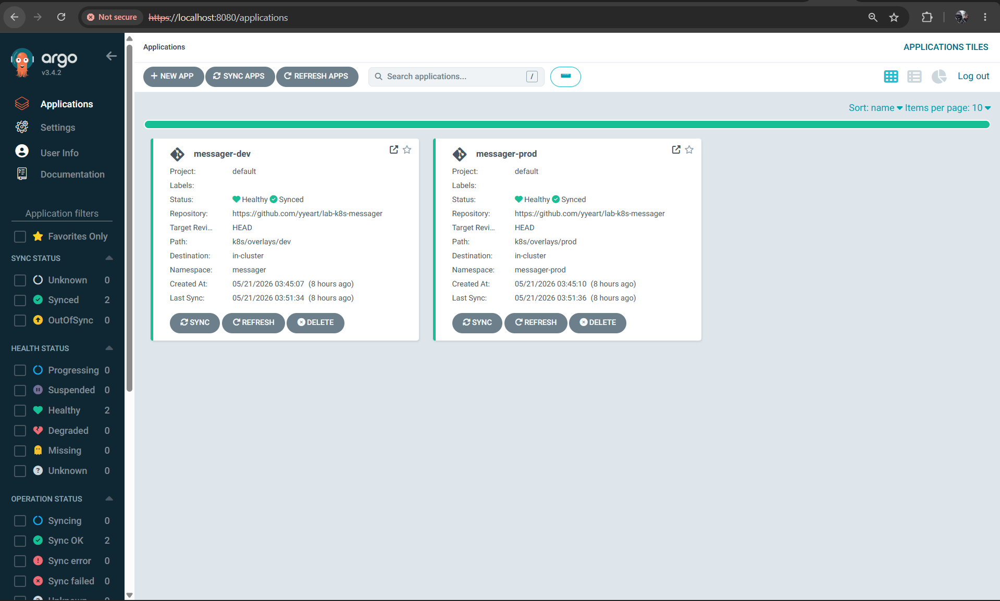

# Подробные детали лабораторной работы

## Драйвер
Установка драйвера должна производиться по инструкции из [репозитория-форка](https://github.com/yyeart/csi-s3)

## Состояние `pods`

## S3 CSI (MinIO)

## Node Affinity

Как мы видим, `message-service` привязан к ноде `messager-m03`, т.к. при ее создании мы указали `disk=fast` 

## Kustomize

### Каталоги
- [base](../k8s/base)
- [dev](../k8s/overlays/dev)
- [prod](../k8s/overlays/prod)

### Состояние подов

### Отличия `dev` и `prod`
- namespace
- число реплик
- ресурсы контейнеров
- параметры PVC/PV
- патчи для frontend
- секреты для CSI

## Argo CD

### Манифесты
- [dev](../argocd/application_dev.yaml)
- [prod](../argocd/application_prod.yaml)

### Статусы

### GitOps-процесс
- GitOps-процесс в этой работе устроен так: Kubernetes-манифесты и kustomize-overlays хранятся в Git-репозитории как единственный источник истины. Argo CD следит за нужной веткой и каталогом (`k8s/overlays/dev` или `k8s/overlays/prod`), и при изменениях в репозитории автоматически синхронизирует состояние кластера с тем, что описано в Git.
- Если кто-то вручную изменит ресурсы в кластере, Argo CD обнаружит расхождение и вернет состояние к ожидаемому благодаря `selfHeal`. За удаление лишних ресурсов отвечает prune, поэтому деплой получается воспроизводимым, прозрачным и не требует ручного kubectl apply после каждого изменения.